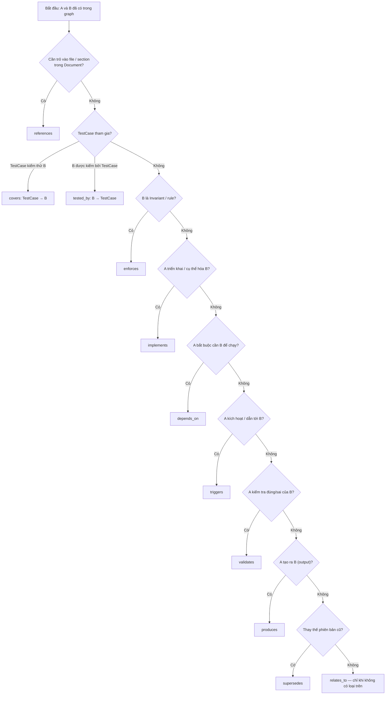

# ◈ GoBP AI USER GUIDE

Document này dành cho AI agents. Đọc trước khi tương tác với GoBP MCP server.

**Bổ sung:** catalog đầy đủ query → [`docs/MCP_TOOLS.md`](MCP_TOOLS.md); field type chi tiết → [`docs/SCHEMA.md`](SCHEMA.md). **Chọn đúng loại cạnh** (`depends_on` vs `relates_to`, …) → mục [Edge types](#edge-types) (sơ đồ + từ điển + bảng theo node type). Trong MCP, gọi `gobp(query="version:")` hoặc `overview: full_interface=true` để xem gợi ý cập nhật theo build.

---

## Query format

```
gobp(query="{action}: {params}")
gobp(query="{action} {params}")
```

---

## Query Rules (bắt buộc)

```
1. overview:          Gọi 1 lần đầu session. Không gọi lại.
2. template:          Trước khi tạo type **chưa quen** trong phiên — biết field bắt buộc / optional. Có thể cần **nhiều** `template: Type` (mỗi type một lần trong **giai đoạn lập kế hoạch**); không đồng nghĩa “mỗi round-trip MCP chỉ được một type”.
3. template_batch:    Khi cần **nhiều node cùng một type** (khung lặp). **Không** có nghĩa mọi lần ghi graph chỉ được một type — xem mục [Template + batch đa loại](#template--batch-đa-loại-mixed-types) bên dưới.
4. suggest:           Trước khi tạo node mới — tìm node tái sử dụng.
5. explore:           Thay cho find+get+related. Dùng compact=true.
6. batch:             Cho **hầu hết** write — **ưu tiên** `batch` / `quick:`; **một** `batch` có thể trộn **nhiều loại** `create:` + `edge+:` + `update:` (không giới hạn “một type mỗi lần”). Tránh chu kỳ lãng phí: `template(Engine)→batch chỉ Engine→template(Flow)→batch chỉ Flow` khi đã biết field — gom **một** batch đa loại. Protocol vẫn có `create:` / `upsert:` đơn lẻ cho tool/script.
7. find:              Default **mode=summary** (danh sách khớp). **`get:`** / **`context`** default **mode=brief** — không nhầm với find.
8. Sau khi có IDs:    Chỉ giữ id+name. Không paste full JSON vào prompt sau.
9. 1 session = 1 mục tiêu. session:end khi xong.
10. Lỗi batch:        Chỉ retry ops bị fail, không retry toàn bộ.
11. Node mới + graph có data:  Node mới (có ý nghĩa) PHẢI **relate** tới ít nhất một node đã tồn tại qua edge hợp lệ — xem **dec:d002** và checklist đầy đủ tại [`docs/IMPORT_CHECKLIST.md`](IMPORT_CHECKLIST.md). Ngoại lệ: node **đầu tiên** trong project chưa có dữ liệu.
12. Import tài liệu:   Đọc **toàn bộ** doc (hoặc toàn bộ section đã thống nhất với CEO) **trước** khi liệt kê plan nodes/edges — không đọc lướt rồi tạo nodes rồi mới nối edges sau.
13. Lesson (dec:d011): Trước khi tạo **Lesson** mới — `suggest:` / `find:` cùng **topic**. Nếu đã có Lesson phù hợp → **cập nhật** node đó (thêm takeaway, giữ nội dung còn giá trị), **không** tạo Lesson trùng topic. Quy tắc này **chỉ** cho type **Lesson** (không áp dụng kiểu “gộp” cho Engine/Flow/Task…).
14. group filter:     Khi cần theo **hierarchy** (Dev > …), dùng **`find: group="..."`** / `group contains` — đừng chỉ `find:Type` nếu câu hỏi là theo nhánh group.
15. get: mode=brief:   Mặc định ẩn raw metadata và **không** trả outgoing/incoming dạng legacy; xem **`relationships`** (có **`reason`** khi có). **`mode=full`** khi cần đủ cạnh legacy + payload đầy đủ.
16. ErrorCase:        Trước import lỗi — `find:` / `group="Error..."` để tránh trùng; **`code`** theo pattern domain (xem `docs/SCHEMA.md`).
17. Invariant:        Type **`Invariant`** cần field **`rule`** (boolean expression). Câu “không được X” thuần policy → **BusinessRule** (hoặc type phù hợp), không nhét vào Invariant.
```

### Import protocol (chi tiết)

Quy trình **template → đọc hết → plan (nodes+edges) → review → batch** nằm trong [`docs/IMPORT_CHECKLIST.md`](IMPORT_CHECKLIST.md).

---

## Session lifecycle

```
# Bắt đầu — bắt buộc trước mọi write
gobp(query="session:start actor='tên_ai' goal='mô tả mục tiêu'")
→ Nhận session_id — dùng cho mọi write

# Kết thúc
gobp(query="session:end outcome='kết quả' session_id='<id>'")
```

---

## Read actions

### overview: — Project state (1 lần/session)
```
gobp(query="overview:")
```

### explore: — Node + edges + breadcrumb + siblings (1 call)
```
gobp(query="explore: TrustGate")                 ← keyword hoặc resolve theo id nếu khớp
gobp(query="explore: dev.infra.engine.xxx.yyyyyyyy")   ← ID trực tiếp ưu tiên
gobp(query="explore: TrustGate compact=true")    ← nhẹ hơn (chuỗi)
```
→ Trả về (full, không compact): **`node`**, **`breadcrumb`** (group path), **`group`**, **`siblings`** (cùng group), **`relationships`** (có **`reason`**), legacy **`edges`** / **`edge_count`**.

### find: — Tìm kiếm
```
# Keyword + mode (Session excluded mặc định)
gobp(query="find: mi hốt mode=summary")           ← Vietnamese OK
gobp(query="find:Engine mode=summary")           ← filter exact type
gobp(query="find: keyword mode=summary")

# Group filters (schema v2) — thêm vào query hoặc params
gobp(query="find: group='Dev > Infrastructure > Security'")
gobp(query="find: group contains 'Security'")
gobp(query="find: group='Dev > Domain' type=Entity")
```

### get: — Chi tiết 1 node (default **brief**)
```
gobp(query="get: node_id")                       ← default mode=brief
gobp(query="get: node_id mode=brief")            ← name / group / description.info / relationships
gobp(query="get: node_id mode=full")             ← fields đầy đủ + outgoing/incoming legacy + relationships
gobp(query="get: node_id mode=debug")            ← raw (chỉ debug)
gobp(query="get: node_id compact=true")          ← id+name+type only
```

### suggest: — Tìm node tái sử dụng (group-aware)
```
gobp(query="suggest: Payment Flow")
gobp(query="suggest: OTP Flow group='Dev > Infrastructure > Security'")
→ Ưu tiên cùng group + type; có thể có HIGH SIMILARITY + recommendation UPDATE vs CREATE
```

### related: — Relationships
```
gobp(query="related: node_id")
```

### template: — Frame nhập liệu
```
gobp(query="template: Engine")
→ required fields + optional fields + suggested edges + batch format
```

### template_batch: — Frame cho nhiều nodes
```
gobp(query="template_batch: Engine count=10")
→ 10 frames trống với edge suggestions
→ Điền → batch submit
→ Không giới hạn nodes hay edges per node
```

### Template + batch đa loại (mixed types)

**Vấn đề:** Nhiều AI chỉ gửi **một loại** node mỗi lần `batch` (hoặc một `gobp` cho Engine, rồi `gobp` khác cho Flow, …) → **lãng phí request** và khó audit một mạch.

**Thực tế:** Một chuỗi `ops` trong **`batch`** là danh sách dòng độc lập; **mỗi dòng** có thể là `create:` **khác type** nhau. Server xử lý tuần tự / chunk nội bộ — **không** yêu cầu “cùng type trong một batch”.

| Công cụ | Khi nào dùng |
|---------|----------------|
| `template_batch: Engine count=N` | Cần **N khung giống nhau** cùng type (ví dụ 10 Engine). |
| `template: A`, `template: B`, … | **Biết field** của từng type trước khi điền — có thể gọi nhiều template trong **cùng phiên lập kế hoạch** (không bắt buộc mỗi template = một round-trip riêng nếu context cho phép gom). |
| **`batch` một lần** | **Ghi thật:** trộn `create: Engine:…`, `create: Flow:…`, `create: Decision:…`, `create: TestCase:…`, … + `edge+:` + `update:` trong **một** `ops='...'`. |

**Ví dụ — một request, nhiều loại node + cạnh:**

```
gobp(query="batch session_id='<id>' ops='
  create: Engine: LedgerSvc | Balances
  create: Flow: Checkout | User pays
  create: Decision: Use ledger for balance | Approved
  edge+: Checkout --depends_on--> LedgerSvc
  edge+: Use ledger for balance --relates_to--> LedgerSvc
'")
```

**Gợi ý quy trình:** Đọc doc / plan → gọi `template:` cho các type cần nhắc field → ghép **một** `batch` duy nhất (đa loại) + `edge+:` → `explore:` / `validate:` → `session:end`.

**quick:** — Mặc định **một format node/line** (pipe); phù hợp ghi nhanh **cùng một “shape”**. Kế hoạch có **nhiều type** khác nhau → ưu tiên **`batch`** với nhiều dòng `create:` như trên, không cố nhét vào `quick:`.

---

## Write actions — Ưu tiên batch / quick

### batch — Nhiều write operations trong một call

```
gobp(query="batch session_id='<id>' ops='
  create: Engine: TrustGate | Trust scoring engine
  create: Engine: AuthEngine | Authentication
  create: Flow: Verify Gate | GPS verification
  update: trustgate.ops.00000001 description=Updated desc
  delete: garbage.meta.00000003
  retype: wrong.meta.00000002 new_type=Engine
  merge: keep=trustgate.ops.06043392 absorb=trustgate.meta.53299456
  edge+: TrustGate --implements--> Mi Hốt Standard
  edge+: TrustGate --depends_on--> CacheEngine
  edge-: TrustGate --relates_to--> CacheEngine
  edge~: TrustGate --relates_to--> GeoIntel to=depends_on
  edge*: TrustGate --implements--> Mi Hốt Standard, Mi Hốt GPS Jitter
'")
```

Ví dụ trên đã **trộn nhiều loại** (`Engine` + `Flow`) trong cùng một `batch`; có thể thêm `create: Decision:`, `create: Feature:`, `create: TestCase:`, … và `edge+:` xen kẽ — **không** cần tách `batch` theo từng type. Chi tiết: mục [Template + batch đa loại](#template--batch-đa-loại-mixed-types).

### Operation reference

| Prefix | Format | Ý nghĩa |
|--------|--------|---------|
| `create:` | `Type: Name \| Description` | Tạo node — auto dedupe |
| `update:` | `id field=value` | Sửa fields — giữ fields khác |
| `replace:` | `id field=value` | Ghi đè toàn bộ — destructive |
| `retype:` | `id new_type=X` | Đổi type — ID mới, migrate edges |
| `delete:` | `id` | Xóa node + cascade edges |
| `merge:` | `keep=id absorb=id` | Gộp 2 nodes — edges migrated |
| `edge+:` | `From --type--> To` | Thêm edge — skip nếu đã có |
| `edge-:` | `From --type--> To` | Xóa edge |
| `edge~:` | `From --old--> To to=new` | Đổi type edge |
| `edge*:` | `From --type--> A, B, C` | Replace tất cả edges loại đó |

### Batch size (đúng với server hiện tại)

- **Không** còn giới hạn cố định kiểu “tối đa 50/500 ops” phía client. Danh sách ops **dài** được server xử lý theo **chunk nội bộ** (200 ops/chunk — implementation trong `gobp/mcp/tools/write.py`).
- Vẫn nên **gom logic** trong một `batch` khi có thể; chỉ chia **nhiều lệnh** `gobp()` khi payload quá lớn cho MCP/JSON hoặc cần tách theo mục tiêu (không phải vì “max 50”).

### quick: — Ghi nhanh nhiều dòng (pipe), delegate sang batch

```
gobp(query="quick: session_id='<id>' ops='Name1 | w1 | d1 | desc1\\nName2 | w2 | d2 | desc2'")
```

Một dòng = một node tối giản; engine xử lý giống batch (cũng chunk nội bộ khi dài).

### Response
```
Default: summary only (~100 tokens)
  "create:5/6 edge+:8/10 merge:1/1"
  + skipped list + errors

verbose=true: full details
```

### Hooks & lỗi (MCP server)

Trước khi ghi, server có thể **chặn sớm** (ví dụ: type không có trong schema; thiếu `session_id` cho một số thao tác). Khi lỗi, response thường có `ok: false`, `error`, và có thể có **`suggestion`** (gợi ý sửa: type hợp lệ, `session:start`, node tương tự…). Đọc `suggestion` trước khi retry.

---

## Các action đọc / bảo trì khác (tham chiếu nhanh)

| Khi cần | Ví dụ |
|--------|--------|
| Protocol / version | `gobp(query="version:")` |
| Nhiều node theo id | `gobp(query="get_batch: ids='node:a,node:b' mode=brief")` |
| Kiểm tra graph / metadata | `gobp(query="validate: metadata")`, `validate: all`, … |
| Tái tính priority | `gobp(query="recompute: priorities dry_run=true")` |
| Import file → graph | `gobp(query="import: path/to/doc.md session_id='…'")` |
| Reload sau sửa tay ngoài MCP | `gobp(query="refresh:")` |
| Thống kê latency MCP | `gobp(query="stats:")` |

Bảng đầy đủ: [`docs/MCP_TOOLS.md`](MCP_TOOLS.md). `overview:` (có thể `full_interface=true`) liệt kê catalog gợi ý.

---

## Schema v2 — node types (93)

Nguồn: `gobp/schema/core_nodes.yaml` (`schema_name: gobp_core_v2`). Field bắt buộc / optional đầy đủ: [`docs/SCHEMA.md`](SCHEMA.md).

| Type | Group | read_order | Mô tả ngắn |
|------|-------|------------|------------|
| **APIContract** | Dev > Infrastructure > API > APIContract | important | Hợp đồng API |
| **APIEndpoint** | Dev > Infrastructure > API > APIEndpoint | reference | HTTP/RPC endpoint |
| **APIMiddleware** | Dev > Infrastructure > API > APIMiddleware | reference | Middleware API |
| **APIRequest** | Dev > Infrastructure > API > APIRequest | reference | Request schema |
| **APIResponse** | Dev > Infrastructure > API > APIResponse | reference | Response schema |
| **AbstractClass** | Dev > Code > AbstractClass | reference | Lớp trừu tượng (code) |
| **Aggregate** | Dev > Domain > Aggregate | important | Aggregate DDD |
| **Alert** | Dev > Infrastructure > Observability > Alert | reference | Cảnh báo vận hành |
| **Animation** | Dev > Frontend > Animation | background | Animation UI |
| **AuthFlow** | Dev > Infrastructure > Security > AuthFlow | foundational | Luồng xác thực |
| **AuthZ** | Dev > Infrastructure > Security > AuthZ | foundational | Phân quyền |
| **BusinessRule** | Constraint > BusinessRule | important | Quy tắc nghiệp vụ (policy) |
| **CDN** | Dev > Infrastructure > Storage > CDN | background | CDN / edge |
| **CacheStrategy** | Dev > Infrastructure > Cache > CacheStrategy | reference | Chiến lược cache |
| **Class** | Dev > Code > Class | reference | Class (code) |
| **CodeEnum** | Dev > Code > Enum | reference | Enum (code) |
| **Command** | Dev > Application > Command | reference | CQRS command |
| **Component** | Dev > Frontend > Component | reference | UI component |
| **Concept** | Document > Concept | important | Khái niệm / glossary |
| **Constant** | Dev > Code > Constant | reference | Hằng (code) |
| **Constructor** | Dev > Code > Constructor | background | Constructor |
| **CtoDevHandoff** | Meta > Handoff > CTO | reference | Bàn giao CTO→dev |
| **DBIndex** | Dev > Infrastructure > Database > Index | background | DB index |
| **DBSchema** | Dev > Infrastructure > Database > Schema | important | DB schema |
| **DTO** | Dev > Application > DTO | background | Data transfer object |
| **Decision** | Document > Decision | foundational | Quyết định kiến trúc |
| **Document** | Document > Spec | important | Tài liệu / spec |
| **DomainEvent** | Dev > Domain > DomainEvent | important | Sự kiện domain |
| **Encryption** | Dev > Infrastructure > Security > Encryption | important | Mã hóa |
| **Engine** | Dev > Infrastructure > Engine | foundational | Engine nghiệp vụ |
| **Entity** | Dev > Domain > Entity | foundational | Thực thể domain |
| **EnvConfig** | Dev > Infrastructure > Config > EnvConfig | reference | Biến môi trường |
| **ErrorCase** | Error > ErrorCase | reference | Lỗi cụ thể (catalog) |
| **ErrorDomain** | Error > ErrorDomain | important | Miền lỗi |
| **EventBus** | Dev > Infrastructure > Messaging > EventBus | important | Event bus |
| **Extension** | Dev > Code > Extension | background | Extension (code) |
| **Feature** | Dev > Application > Feature | important | Tính năng |
| **FeatureFlag** | Dev > Infrastructure > Config > FeatureFlag | reference | Feature flag |
| **Field** | Dev > Code > Field | background | Field (code) |
| **FileStorage** | Dev > Infrastructure > Storage > FileStorage | background | Lưu trữ file |
| **Flow** | Dev > Application > Flow | important | Luồng / quy trình |
| **Function** | Dev > Code > Function | reference | Function (code) |
| **Generic** | Dev > Code > Generic | reference | Generic (code) |
| **Idea** | Document > Idea | background | Ý tưởng thô |
| **Interface** | Dev > Code > Interface | important | Interface (code) |
| **Invariant** | Constraint > Invariant | foundational | Bất biến (boolean) |
| **Layout** | Dev > Frontend > Layout | background | Layout UI |
| **Lesson** | Document > Lesson > Dev | reference | Bài học (generic) |
| **LessonCTO** | Document > Lesson > CTO | reference | Bài học CTO |
| **LessonDev** | Document > Lesson > Dev | reference | Bài học dev |
| **LessonQA** | Document > Lesson > QA | reference | Bài học QA |
| **LessonRule** | Document > Lesson > Rule | foundational | Rule lesson |
| **LessonSkill** | Document > Lesson > Skill | important | Skill lesson |
| **LogSpec** | Dev > Infrastructure > Observability > Log | reference | Chuẩn log |
| **Method** | Dev > Code > Method | background | Method (code) |
| **Metric** | Dev > Infrastructure > Observability > Metric | reference | Metric observability |
| **Migration** | Dev > Infrastructure > Database > Migration | reference | DB migration |
| **Mixin** | Dev > Code > Mixin | background | Mixin (code) |
| **Module** | Dev > Code > Module | reference | Module (code) |
| **NamedQuery** | Dev > Infrastructure > Database > Query | reference | Named query |
| **Node** | Meta > Graph > Node | reference | Node generic graph |
| **Parameter** | Dev > Code > Parameter | background | Parameter (code) |
| **Permission** | Dev > Infrastructure > Security > Permission | important | Quyền |
| **Policy** | Dev > Infrastructure > Security > Policy | important | Policy bảo mật |
| **Postcondition** | Constraint > Postcondition | important | Hậu điều kiện |
| **Precondition** | Constraint > Precondition | important | Tiền điều kiện |
| **QaCodeDevHandoff** | Meta > Handoff > QA | reference | Bàn giao QA→dev |
| **Queue** | Dev > Infrastructure > Messaging > Queue | reference | Hàng đợi message |
| **Repository** | Dev > Infrastructure > Repository | reference | Repository (data) |
| **Screen** | Dev > Frontend > Screen | reference | Màn hình UI |
| **Secret** | Dev > Infrastructure > Security > Secret | important | Secret / credential |
| **SecurityAudit** | Dev > Infrastructure > Security > Audit | reference | Audit bảo mật |
| **Seed** | Dev > Infrastructure > Database > Seed | background | Seed data |
| **Session** | Meta > Session | background | Phiên làm việc |
| **Spec** | Document > Spec | important | Spec tài liệu |
| **Task** | Meta > Task | background | Task queue |
| **TestCase** | Test > TestCase | background | Ca kiểm thử |
| **TestKind** | Test > TestKind | reference | Loại test |
| **TestSuite** | Test > TestSuite | reference | Bộ test |
| **Theme** | Dev > Frontend > Theme | background | Theme UI |
| **ThreatModel** | Dev > Infrastructure > Security > ThreatModel | important | Threat model |
| **Token** | Dev > Infrastructure > Security > Token | important | Token (auth) |
| **Topic** | Dev > Infrastructure > Messaging > Topic | reference | Topic messaging |
| **TraceSpec** | Dev > Infrastructure > Observability > Trace | reference | Trace spec |
| **TypeAlias** | Dev > Code > TypeAlias | background | Type alias |
| **UIState** | Dev > Frontend > State | reference | State UI |
| **UseCase** | Dev > Application > UseCase | reference | Use case |
| **ValueObject** | Dev > Domain > ValueObject | important | Value object |
| **Variable** | Dev > Code > Variable | background | Variable (code) |
| **Vulnerability** | Dev > Infrastructure > Security > Vulnerability | important | Lỗ hổng bảo mật |
| **Wave** | Meta > Wave | background | Đợt / sóng triển khai |
| **Webhook** | Dev > Infrastructure > API > Webhook | background | Webhook |
| **Worker** | Dev > Infrastructure > Messaging > Worker | reference | Worker xử lý |

**Đọc thêm (index + validate chu trình):** `find` / `explore` / `suggest` / `related` dùng index trong RAM khi có; `validate:` có thể cảnh báo chu trình trên `depends_on` / `supersedes` — xem `gobp/core/indexes.py`, `graph_algorithms.py`.

**Legacy id_groups** (`id_groups` trong `.gobp/config.yaml`): `core` / `domain` / `ops` / `test` / `meta` vẫn dùng cho một số đường sinh id cũ — song song với **id v2** (mục ID format bên dưới).

---

## Edge types

### Bảng tóm tắt

| Type | Ý nghĩa |
|------|---------|
| `implements` | Bản thể hiện / triển khai spec (abstract → concrete) |
| `depends_on` | **Phụ thuộc vận hành** — A cần B thì mới đúng / chạy được |
| `enforces` | Áp rule / invariant / quyết định |
| `tested_by` | Đối tượng nghiệp vụ **được** test bởi TestCase (chiều: Flow/Engine/… → TestCase) |
| `covers` | TestCase **phủ** chức năng node (chiều: TestCase → Flow/Engine/…) |
| `of_kind` | TestCase thuộc TestKind (thường song song field `kind_id`) |
| `references` | Trỏ tới **Document** (đọc thêm chi tiết ở file) |
| `triggers` | Kích hoạt / dẫn tới (luồng, engine, feature…) |
| `validates` | Kiểm tra tính đúng đắn (engine/flow/test → entity/feature/…) |
| `produces` | Tạo ra output / artefact (entity, node…) |
| `relates_to` | **Mặc định mềm** — cùng chủ đề, liên quan, chưa đủ tiêu chí edge có nghĩa hơn |
| `supersedes` | Phiên bản mới thay thế cũ (Idea/Decision/Node) |
| `discovered_in` | Metadata: node tạo trong session (thường do hệ thống/ghi nhận) |

**Nguồn ràng buộc cặp type:** `gobp/schema/core_edges.yaml` — validator từ chối cạnh `from`/`to` không thuộc `allowed_node_types`.

---

### `depends_on` vs `relates_to` — tránh nhầm (quan trọng)

| | `depends_on` | `relates_to` |
|---|----------------|---------------|
| **Câu hỏi** | “Nếu thiếu B thì A **không hoạt động đúng**?” | “A và B **cùng không gian nghĩa** nhưng không cần mô hình phụ thuộc cứng?” |
| **Chiều** | Có hướng: **From phụ thuộc To** (`A --depends_on--> B` = A cần B) | Schema khai báo *không định hướng*; vẫn ghi `from`/`to` khi batch |
| **Ví dụ đúng** | `Flow --depends_on--> Engine` (luồng cần engine); `Engine --depends_on--> Engine` (service phụ thuộc service) | Hai Feature cùng epic; Idea liên quan Decision nhưng chưa lock |
| **Ví dụ sai** | Dùng `depends_on` chỉ vì “có liên quan” | Dùng `relates_to` cho chuỗi **bắt buộc** build/runtime |

Nếu đủ điều kiện edge chuyên biệt (`implements`, `triggers`, `validates`, `references`, …) thì **ưu tiên edge chuyên biệt**, không gom vào `relates_to`.

---

### Sơ đồ chọn loại cạnh (gợi ý)



*(Nếu viewer không vẽ được Mermaid: đọc tiếp hai bảng ngay bên dưới — “depends_on vs relates_to” và “Từ điển cạnh”.)*

---

### Từ điển cạnh (dictionary)

Chiều batch: `edge+: FromId --edge_type--> ToId` (From là nút nguồn theo định nghĩa schema).

| `edge_type` | Ý nghĩa một câu | Cặp type điển hình (From → To) | Ghi chú |
|-------------|-----------------|----------------------------------|---------|
| `depends_on` | A **cần** B (vận hành / build logic). | Engine→Engine, Flow→Engine, Flow→Entity, Flow→Flow, Engine→Flow, Feature→Feature, Node→Node | Dùng cho DAG phụ thuộc; `validate:` có thể báo chu trình. |
| `relates_to` | Liên kết chung, không mô tả phụ thuộc cứng. | Mọi type (schema: `all`) | **Không** thay cho `depends_on` khi ý là “bắt buộc có B”. |
| `implements` | Code/node **cụ thể hóa** quyết định / node trừu tượng. | Node→Decision, Node→Node | Khác `depends_on`: “là bản thể hiện của” chứ không phải “cần để chạy”. |
| `references` | Đọc chi tiết ở Document. | * → Document | Có optional `section`, `lines`. |
| `triggers` | Luồng/engine/feature **dẫn tới** hành vi / node khác. | Flow/Engine/Feature → Flow, Engine, Feature, Node, … | Rộng; chỉ dùng khi có quan hệ “kích hoạt”. |
| `validates` | Kiểm tra tính hợp lệ / đúng rule. | Engine/Flow/TestCase → Entity, Node, Feature | Khác `tested_by` (kiểm thử tự động). |
| `produces` | Output / thực thể sinh ra. | Flow/Engine/Feature → Entity, Node | “Tạo ra” artefact domain. |
| `enforces` | Ràng buộc bắt buộc. | Engine/Flow/Feature/Decision → Invariant; Decision→Decision, Decision→Node | |
| `tested_by` | Đối tượng được cover bởi kiểm thử. | Flow/Engine/Feature/Node → TestCase | Cùng với `covers` (hai phía của cùng một quan hệ test). |
| `covers` | Ca test phủ phần nào của hệ thống. | TestCase → Flow, Engine, Feature, Idea, Decision, Node | Từ TestCase nhìn ra “bị test”. |
| `of_kind` | Thuộc loại kiểm thử. | TestCase → TestKind | Thường khớp `kind_id`. |
| `supersedes` | Phiên mới thay phiên cũ. | Idea/Decision/Node → cùng loại | Versioning ý tưởng/quyết định. |
| `discovered_in` | Ghi nhận provenance session. | * → Session | Ít khi gõ tay; MCP/ghi có thể tự gắn. |

---

### Theo từng loại node: phương pháp nhập & cạnh gợi ý

**Quy ước chung:** `template: <Type>` (hoặc `template_batch:`) → điền field → `batch` với `create:` + `edge+:` trong cùng (hoặc liền kề) batch. Ưu tiên đọc `docs/IMPORT_CHECKLIST.md` (dec:d002).

| Node type | Cách nhập khuyến nghị | Cạnh thường dùng (không exhaustive) |
|-----------|------------------------|-------------------------------------|
| **Engine** | `create: Engine: Name \| desc` trong `batch`; field thêm bằng `update:` | `depends_on` (stack), `references` (doc), `triggers` / `validates` tùy mô hình |
| **Flow** | Giống Engine; mô tả bước người dùng | `depends_on` (Flow/Engine/Entity), `triggers`, `references` |
| **Entity** | `create: Entity: …` | Được `depends_on` bởi Flow; `validates`, `produces` |
| **Feature** | `create: Feature: …` | `depends_on`, `triggers`, `implements` (nếu map sang spec), `tested_by` |
| **Node** (generic) | Khi không gán subtype rõ | `implements`, `depends_on`, `relates_to` |
| **Decision** | `create: Decision: …`; cần đủ field lock theo SCHEMA | `enforces`, `discovered_in`, `supersedes`; edge tới Idea/Document qua `relates_to` / `references` |
| **Idea** | Capture nhanh; maturity | `relates_to` tới Decision/Node; `supersedes` khi thay thế |
| **Document** | `import:` file **hoặc** `create: Document:` + field `source_path`, `content_hash` (xem template); batch vẫn được | Được `references` từ mọi thứ cần trích dẫn |
| **Concept** | `create: Concept:` + `definition` / auto-fill | `relates_to` tới Decision/Engine; ít dùng `depends_on` |
| **Lesson** | `create: Lesson:` — **dec:d011**: `suggest:` trùng topic trước | `relates_to`, `discovered_in` |
| **TestKind** | Một node = một kind; `create: TestKind:` | TestCase dùng `of_kind` + field `kind_id` |
| **TestCase** | `create: TestCase:` + `kind_id`; sau đó `covers` / phía đối tượng dùng `tested_by` | `covers` → Flow/Engine/…; `of_kind` → TestKind |
| **Invariant** | `create: Invariant:` | `enforces` từ Flow/Engine/Feature/Decision |
| **Screen** / **APIEndpoint** / **Repository** | `create:` theo template | `depends_on`, `references`, `relates_to` tới Feature/Engine |
| **Wave** / **Task** | Wave cho lộ trình; Task cho việc queue | `relates_to`, `depends_on` (Task phụ thuộc output) |
| **CtoDevHandoff** / **QaCodeDevHandoff** | Theo template lane | `relates_to` tới Task/Decision |
| **Session** | **`session:start`** / `session:end` — **không** thay bằng `create: Session` trừ khi tooling đặc biệt | Mọi write trong phiên gắn `session_id`; `discovered_in` → Session |

---

## ID format

**Schema v2 (generator hiện tại — `gobp/core/id_generator.py`):**

```
{group_slug}.{name_slug}.{8hex}

dev.domain.entity.traveller_a1b2c3d4
dev.infra.sec.authflow.otp_b2c3d4e5
const.invariant.balance_nonneg_c3d4e5f6
error.case.gps_e_001_d4e5f6a7
```

- `group_slug`: từ breadcrumb **`group`** (`>` → `.`, segment rút gọn — xem `_ABBREV` trong `id_generator.py`).
- `name_slug`: tên hiển thị đã slugify (ASCII).
- `8hex`: hậu tố từ hash (tránh trùng).

**Legacy / đặc biệt (vẫn gặp trong graph cũ):**

```
trustgate_engine.ops.00000002        ← id legacy theo tier
meta.session.2026-04-17.a3f7c2abc    ← Session
```

---

## Workflow chuẩn

### Import với schema v2

1. **`template: Type`** — xem **`group`** mặc định + field bắt buộc (`description.info`, …).
2. **`suggest: name group="Dev > …"`** — trùng group / HIGH SIMILARITY trước khi tạo (dec:d011 cho Lesson).
3. **`batch`** — khai báo **`group`** trong `create:` nếu khác default; Validator **auto_fix** có thể điền group/lifecycle/read_order khi thiếu.
4. **`explore: node_id`** — kiểm **breadcrumb**, **siblings**, **relationships** (reason).

### Import data mới
```
1. overview:                         ← hiểu project
2. session:start                     ← bắt đầu
3. template: / template_batch:       ← frame: cùng type nhiều bản = template_batch;
                                       nhiều type khác nhau = gọi template: từng type cần,
                                       rồi gom MỘT batch (đa loại) — xem mục đa loại
4. Điền placeholders / plan create + edge
5. batch session_id='x' ops='...'    ← submit (có thể trộn Engine+Flow+Decision+…)
6. explore: … compact=true           ← verify
7. session:end                       ← kết thúc
```

### Tìm và sử dụng node
```
1. suggest: Payment Flow             ← tìm reusable
2. explore: EmberEngine              ← xem chi tiết + edges
3. Nếu cần → batch edge+            ← tạo relationship
```

### Sửa data sai
```
1. explore: TrustGate                ← thấy 3 duplicates
2. batch:
     merge: keep=id_a absorb=id_b
     merge: keep=id_a absorb=id_c
     edge~: id_a --relates_to--> X to=depends_on
```

---

## Token guide

| Action | Tokens ước tính |
|--------|:-:|
| overview: | ~800 |
| explore: compact | ~200 |
| explore: full | ~800 |
| find: mode=summary (20 results) | ~400 |
| find: mode=full (20 results) | ~2000 |
| suggest: (10 results) | ~400 |
| template: | ~300 |
| batch response (summary) | ~100 |
| batch response (verbose) | ~500+ |

---

## Những điều KHÔNG làm

```
❌ Gọi overview: mỗi lần cần data → gọi 1 lần
❌ Nhiều write mà không gom **batch** / **quick:** → tách nhóm logic / dùng quick khi format pipe
❌ find: keyword rộng → find:Type keyword mode=summary
❌ Paste full JSON response vào prompt sau → chỉ giữ id+name
❌ Tạo node mới mà không suggest: trước → duplicate risk (với **Lesson** bắt buộc tuân **dec:d011** ở rule 13)
❌ Ghi mà không có session_id → bị reject hoặc hook chặn sớm
```

---

## Phụ lục (tối thiểu)

Response thường có `_protocol` (phiên bản protocol) và có thể có `_dispatch` (audit route). Read-only: `GOBP_READ_ONLY=true`. Field / cạnh đầy đủ: `docs/SCHEMA.md`, `gobp/schema/core_nodes.yaml`, `gobp/schema/core_edges.yaml`. Import vào graph: [`docs/IMPORT_CHECKLIST.md`](IMPORT_CHECKLIST.md). Lỗi graph hoặc MCP cũ: `python -m gobp.cli validate --scope all`, `seed-universal` nếu cần, Reload Window / restart Cursor.

◈
